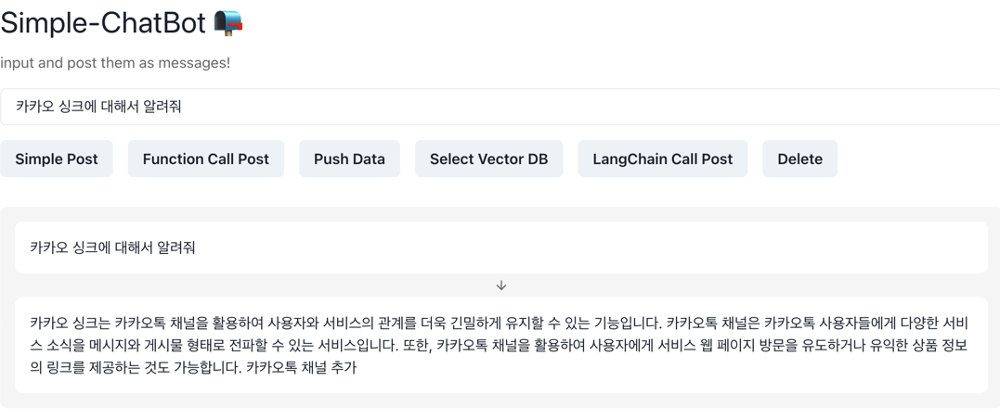

# My Project

## Features

### Simple Post
- 간단한 chat bot

### Function Call Post
- 카카오 싱크 문서를 function call로 열람

### Push Data
- Vector DB에 문서 삽입. **반드시 한 번만 실행할 것**

### Select Vector DB
- Vector DB 쿼리 조회

### LangChain Call Post
- Kakao 서비스 문서 열람, 인터넷 검색, history 저장 DB를 사용하는 chat bot

### Delete
- 지금까지의 메시지 삭제 (**DB history는 수동으로 삭제 필요**)
